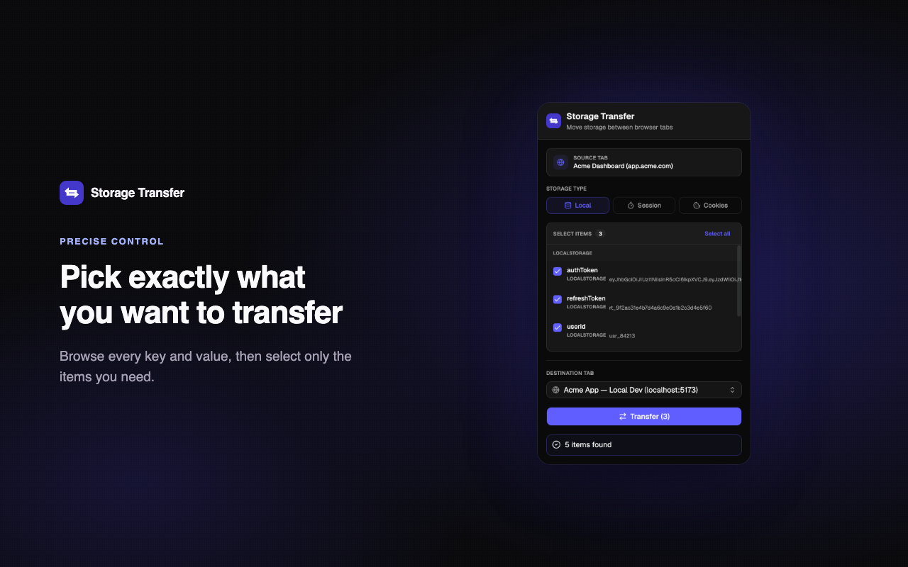
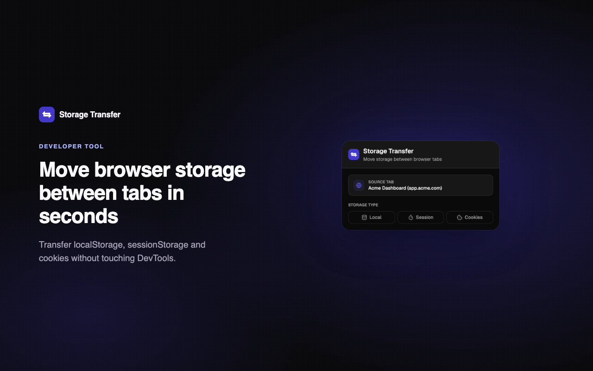
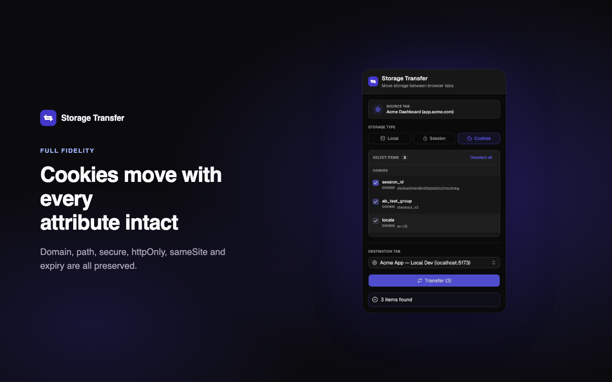
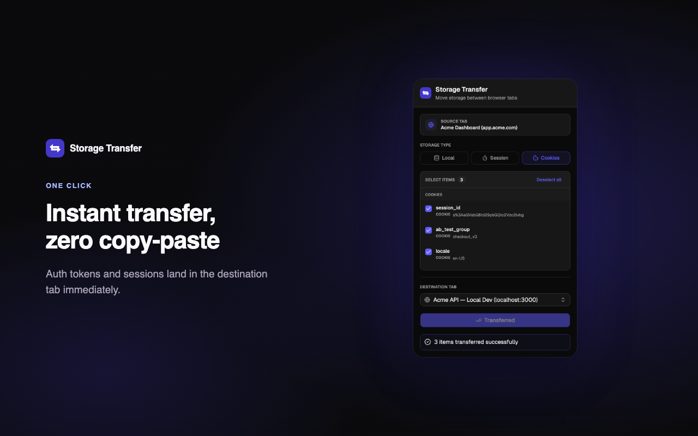

# Storage Transfer

Developer tool for transferring `localStorage`, `sessionStorage`, and cookies between browser tabs.

> For developers only. Built to move storage data between environments (localhost, staging, production) during development and testing.

**[Install from the Chrome Web Store →](https://chromewebstore.google.com/detail/storage-transfer/aodnlopajionekfhldpoddodfibcffek)**

<p align="center">
  
</p>

## Screenshots

| | |
|---|---|
|  |  |
|  |  |

## Features

- Transfer localStorage, sessionStorage, and cookies between tabs
- Select exactly which items to transfer
- Searchable destination-tab picker (type to filter by title or host)
- Cookies transfer with every attribute intact: domain, path, secure, httpOnly, sameSite, expiration
- Smart tab sorting — localhost and dev domains surface first
- Works only with HTTP/HTTPS tabs

## Tech stack

- Manifest V3 (Chrome Extensions API)
- TypeScript + React 19
- Vite + [@crxjs/vite-plugin](https://crxjs.dev/vite-plugin) for MV3 bundling
- Tailwind CSS v4 + [shadcn/ui](https://ui.shadcn.com)
- [Bun](https://bun.sh) as package manager / runtime

## Development

```bash
bun install
bun run dev      # Vite dev server with HMR for the extension
bun run build    # production build -> dist/
```

Load the extension:

1. `bun run build`
2. Open `chrome://extensions/`
3. Enable "Developer mode"
4. Click "Load unpacked" and select the `dist/` folder
5. After code changes, re-run `bun run build` and click the refresh icon on the extension card (or use `bun run dev`, which CRXJS hot-reloads into an already-loaded unpacked extension)

## Usage

1. Open the tab with storage data you want to copy
2. Click the extension icon
3. Select storage type (Local, Session, or Cookies)
4. Check the items you want to transfer
5. Search for and pick a destination tab
6. Click "Transfer"

## Common use cases

- Copy auth tokens from production to localhost to test with real user sessions locally
- Transfer session data between ports, e.g. `:3000` to `:8080`
- Debug with production cookies by replicating user issues in a dev environment
- Copy storage between staging/dev/prod for multi-environment testing

## Permissions

The extension requests the minimum permissions its features need:

- `cookies` — read cookies from the source tab and write selected cookies to the destination tab
- `scripting` — inject a script to read storage in the source tab and write it in the destination tab (the core transfer mechanism)
- `<all_urls>` host permission — source and destination tabs are often on different domains (e.g. production vs. localhost), so both permissions above need host access that isn't known ahead of time

No analytics, no telemetry, no remote servers — see [`store/PRIVACY.md`](store/PRIVACY.md).

## Project structure

```
storage-transfer/
├── manifest.config.ts        # MV3 manifest (source of truth, typed)
├── vite.config.ts            # Vite + CRXJS + Tailwind config
├── index.html                 # popup entry
├── public/icons/              # extension icons (16/48/128)
├── src/
│   ├── main.tsx
│   ├── App.tsx
│   ├── index.css              # Tailwind + theme tokens
│   ├── assets/
│   │   └── logo.svg           # source vector for the app icon
│   ├── hooks/
│   │   └── use-storage-transfer.ts   # state + orchestration
│   ├── lib/
│   │   ├── chrome-storage.ts  # typed chrome.* API wrappers
│   │   ├── types.ts
│   │   └── utils.ts
│   └── components/
│       ├── ui/                 # shadcn/ui primitives
│       ├── current-tab-card.tsx
│       ├── storage-type-toggle.tsx
│       ├── storage-items-list.tsx
│       ├── target-tab-select.tsx     # searchable destination combobox
│       ├── tab-favicon.tsx
│       └── status-alert.tsx
├── store/                     # Chrome Web Store submission assets
│   ├── screenshots/           # 1280×800 listing screenshots
│   ├── promo-tile-440x280.png
│   ├── listing.md             # store copy + permission justifications
│   └── PRIVACY.md             # privacy policy to host and link
└── dist/                      # build output, load this as unpacked extension
```

## How it works

**localStorage / sessionStorage**
- `chrome.scripting.executeScript()` injects a reader into the source tab
- User selects specific items to transfer
- A writer is injected into the destination tab via `setItem()`

**Cookies**
- `chrome.cookies.getAll()` reads cookies from the source URL
- All attributes are preserved: domain, path, secure, httpOnly, sameSite, expiration
- `chrome.cookies.set()` writes to the destination tab

**Tab sorting**
- Destination tabs are sorted by priority: `localhost` → `127.0.0.1` → `192.x` → `dev.` domains → others

## Browser support

- Chrome 88+
- Edge 88+ (Chromium)
- Brave, Opera (should work)

## Troubleshooting

- Extension only works on HTTP/HTTPS pages, not `chrome://` pages
- Both source and destination tabs must be fully loaded

## Publishing to the Chrome Web Store

Everything needed for submission lives in [`store/`](store/):

```bash
bun run build
cd dist && zip -r -X ../storage-transfer.zip . -x ".*" && cd ..
```

Then, in the [Developer Dashboard](https://chrome.google.com/webstore/devconsole):

1. Upload `storage-transfer.zip` as the package
2. Paste the summary/description from [`store/listing.md`](store/listing.md)
3. Upload the screenshots in [`store/screenshots/`](store/screenshots/) and the promo tile
4. Fill in the Privacy practices tab using the justifications in `store/listing.md`, and link a hosted copy of [`store/PRIVACY.md`](store/PRIVACY.md) as the privacy policy URL

## License

MIT
